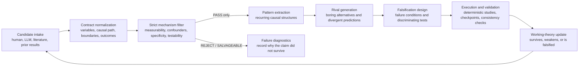

# Meno-J: A Falsification-Oriented Architecture for AI

Short name: **Meno-J Falsification Engine**

## Core framing

Speculation is only the input. The contribution is the disciplined transformation of candidate claims into filtered mechanisms, recurring structures, explicit rivals, decisive tests, and validated updates to a working theory.

Meno-J is therefore source-agnostic. Candidate claims may come from a human expert, an LLM, literature synthesis, automated search, prior results, or a curated hypothesis bank. No candidate source receives epistemic privilege.

## Architecture

## Component responsibilities

| Component | Responsibility | Scientific contract |
|---|---|---|
| Candidate intake | Supply claims worth testing | Diversity without authority; generation quality is not evidence |
| Contract normalization | Make a claim auditable | Name variables, causal paths, directions, boundaries, outcomes, data needs, and failure conditions |
| Strict mechanism filter | Prevent weak claims from advancing | Enforce measurable variables, valid causal chains, identified confounders, clear data requirements, domain specificity, and testability |
| Failure diagnostics | Preserve information from non-survivors | Record exact failed checks; never silently discard or promote a claim |
| Pattern extraction | Move beyond isolated hypotheses | Identify recurring causal structures and boundary conditions across survivors |
| Rival generation | Challenge preferred explanations | Produce plausible alternatives with predictions that diverge from the working mechanism |
| Falsification design | Make the theory vulnerable | Specify decisive tests, operational failure conditions, minimum data, and error risks |
| Execution and validation | Replace rhetoric with evidence | Use checkpointed, reproducible studies and fail loudly on contract violations |
| Working-theory update | Accumulate disciplined knowledge | Mark claims or patterns as surviving, weakened, falsified, or inconclusive |

## What the experiments established

| Evidence | Architectural lesson |
|---|---|
| Experiment 1 produced zero PASS hypotheses across Q1–Q3 under the baseline pipeline | Unstructured speculation is not a reliable scientific product; rejection diagnostics are useful evidence |
| Experiment 2’s enrichment stage sharply increased survival | Explicit mechanism, confounder, rival, and data contracts matter more than the identity of the generator |
| Experiment 3 synthesized survivors across questions into recurring patterns | Cross-candidate structure extraction is a distinct contribution beyond hypothesis generation |
| Experiment 4 converted recurring patterns into competing explanations and a ranked falsification roadmap | The engine creates value by making working theories vulnerable to decisive counterevidence |
| Experiment 5 falsified the broad finite-sample-only P4 explanation | A successful run may eliminate an attractive explanation rather than produce a new one |
| Experiment 6 confirmed persistent structural failures and isolated safer and more dangerous score-conditioning pairs | Deterministic execution can refine a falsified broad claim into actionable boundary conditions |
| Experiment 7 Q2 passed all candidates and triggered rubber-stamp red flags | High survival is not automatically success; calibration diagnostics remain necessary even after builder stages |
| Experiment 8 found that oracle region conditioning achieved 0.9920 low-prevalence rare-group coverage while returning the full three-label set 0.9901 of the time; noisy metadata caused a maximum 0.6463 rare-coverage penalty | Coverage alone can mistake conservative, abstention-like output for repair; effective subgroup size, informativeness, and metadata fidelity are part of the scientific contract |
| Experiment 9 tested the synthetic safest and dangerous pairs on integrity-verified WESAD data; the synthetic safest pair had 0.3429 worst-subject coverage and 0.7577 full-set frequency versus 0.6000 and 0.1985 for the comparator | Synthetic rankings are hypotheses, not portable evidence; real-data transfer testing must jointly evaluate tail coverage and prediction-set informativeness |
| Experiment 10 moved held-out subjects from external to limited personal calibration; cohort coverage improved, but S2/S4 required full-set-frequency increases of 0.3556 and 0.4222, and nearest-centroid calibration failed its decision rule | Calibration readiness is a continuum: a finite or high-coverage threshold is not necessarily informative, and simple physiological similarity is not yet a validated bridge from cold start to personalization |
| Experiment 11 crossed the conformal order-statistic boundary and altered representation; k=19 reduced full sets but cost 0.1333 worst-subject coverage, while subject normalization raised accuracy by 0.1585 and reduced full sets by 0.1022 | Calibration readiness is a subject-conditional surface coupling threshold stability with representation adequacy; crossing either axis alone does not guarantee safe, informative prediction |
| Experiment 12 temporally replicated normalization across early/middle/late holdouts but found nearly identical k=18-to-k=19 coverage changes before and after normalization; temperature ablation did not replicate | Retain representation adequacy and calibration safety as separate readiness gates; do not claim an interaction, sensor mechanism, or universal J-jump unless it survives a predeclared replication test |
| Experiment 13 externally tested normalization on a 33-subject independent Empatica cohort; accuracy improved only 0.0436, full sets fell 0.0909, and normalized coverage fell below the frozen safety floor to 0.8681 | A sharper or modestly more accurate representation is not a validated repair unless effect magnitude and calibration safety both replicate; the engine must reject attractive partial successes |
| Experiment 14 reduced normalized class-coverage imbalance from 0.0972 to 0.0114 with class-Mondrian calibration, but mean coverage remained 0.8769 and worst-subject coverage fell to 0.6875 | A mechanism can explain one structural symptom without being sufficient for repair; aggregate and class balance cannot substitute for subject-level safety |

## Terminology mapping

| Historical term | Falsification-engine term |
|---|---|
| Dreamer | Optional speculative candidate-intake adapter |
| Builder stages | Contract normalization |
| Strict Mechanism Auditor | Strict mechanism filter |
| Survivor synthesis | Cross-candidate pattern extraction |
| Rival Prediction Matrix | Rival generation and discriminating predictions |
| Falsification Agent | Falsification design |
| Experiment pipeline | Checkpointed evidence workflow |

Historical names remain in schemas, prompts, filenames, and experiment reports for reproducibility. The mapping changes the interpretation of those components, not their recorded behavior.

## Operating rules

1. Treat every candidate as speculative regardless of source.
2. Require explicit contracts before audit; fluent prose is insufficient.
3. Allow only PASS candidates into rival and falsification stages.
4. Preserve exact rejection and salvage diagnostics.
5. Extract recurring structures across candidates and questions rather than promoting isolated stories.
6. Prefer rivals that make measurably different predictions.
7. Define failure conditions before interpreting results.
8. Use deterministic execution where possible and checkpoint all model-dependent stages.
9. Fail loudly on schema, ID, routing, or consistency violations.
10. Treat falsification, weakening, and inconclusive outcomes as valid scientific products.
11. Report subgroup coverage together with subgroup effective calibration size, finite-threshold probability, set size, full-set frequency, and metadata quality.
12. Require real-data transfer validation before promoting a simulation-derived method ranking into the working theory.
13. Treat finite-threshold availability, nominal coverage, and useful calibration as separate milestones rather than one binary notion of readiness.
14. Evaluate calibration size and representation quality jointly; require subject-level safety because cohort improvements can conceal opposite responses in difficult subjects.
15. Distinguish replication of a component effect from replication of the proposed architecture connecting effects; when an interaction fails, narrow the working theory even if both components remain important.
16. Treat external-dataset acquisition and inventory as a scientific gate: validate licensing, provenance, archive integrity, subject constraints, and label semantics before freezing or computing transfer outcomes.
17. Require independent effect-size and calibration-safety gates before promoting a representation change; favorable efficiency or accuracy alone is insufficient.
18. When class conditioning balances marginal errors but subject-level failures persist, retain class asymmetry only as a partial mechanism and test subject reliability next.

## Scope of the contribution

Meno-J does not claim that an LLM can originate reliable scientific hypotheses autonomously. It provides a falsification-oriented control architecture around uncertain candidate inputs. Its primary outputs are:

- auditable survivor and rejection sets;
- recurring structural patterns;
- explicit competing explanations;
- discriminating predictions and failure conditions;
- ranked experimental roadmaps;
- reproducible evidence that updates or eliminates working explanations.

## Compatibility and preservation

- Existing Experiment 1–7 artifacts retain their historical names and contents.
- Existing checkpoints remain valid and are not rewritten by this reframing.
- The Dreamer adapter remains supported for backward compatibility.
- Future candidate sources can bypass Dreamer if they satisfy the same Stage 4 hypothesis contract.
- No experiment result is reinterpreted as stronger evidence merely because the architecture name changed.
